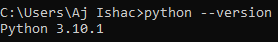
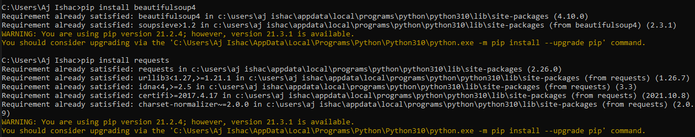
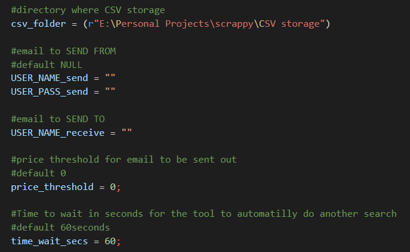

# Newegg-GPU-Webscraping-Tool

Python based tool designed to retrieve Graphic Card product information from Newegg based on user-input.
Extracted data will be later fed to the Data-Processing-And-Lookup-Tool-v2 to analyze and streamline decision making on the user's part.

The program will be responsible for the following processes:
  1. Extract title, price, and link of all products found from the website filtered by user-input.
  2. Output all extracted data into a CSV file to be handled by the Data-Processing-And-Lookup-Tool-v2.
  3. Email notification when price is within range of the user's choice.
  4. Seamless communication between the Newegg-GPU-Webscraping-Tool and Data-Processing-And-Lookup-Tool-v2

## The following is a step by step process on how to configure the tool for the user's use:

> ## **Prerequisite Needed:**
**Install current version of Python**
```
https://www.youtube.com/watch?v=xXEt9dyvq3U
```
**Run the following in Command Prompt as Admin**
```
python --version
```


```
pip install beautifulsoup4
```
```
pip install requests
```


> ## **File dependencies:**  
- Newegg-GPU-Webscraping-Tool/scrappy.py  
- Newegg-GPU-Webscraping-Tool/config.py  

Scrappy.py is the main file, config.py stores user-preferences.  
On file compile, user will be prompted to input key-term to search for the Graphic Card with.  
Tool may only search for one input at a time, however multiple instances of the tool can be open at the same time.  
`examples of search term user-input: 1080, 2080, 3070, 3080, 3090`  

Tool config settings are stored in the config.py file.  
The following inputs may be customized to the user's choice if they wish to do so.  
Tool will need its `csv_folder` directory configured to save CSV file under the correct path.

Configuations to set up are as follows:  
  

> ## **Setting up slave email to send from:**  
If the user wishes to use the Email Alert functionality the following steps will be needed.
 1. Set up a Gmail slave account for sending your emails. Since you’ll be feeding a plaintext password to the program, Google considers the SMTP connection less secure.
 2. As such, go to the newly created Gmail account settings and [allow less secure apps](https://myaccount.google.com/lesssecureapps) to access the account.

And you're set!  
The tool will run every `time_wait_secs` and it will search Newegg's GPUs for `search_term`.  
Results will be printed out in the console and CSV file will be output according to the path the `csv_folder` is set up to.  
Emails will be sent to the email `USER_NAME_receive`, from slave email configured under `USER_NAME_send` and  `USER_PASS_send`.  

After that, we'll be moving on to the Data-Processing-And-Lookup-Tool-v2 to import the newly created CSV file, present and manipulate the data from there!
